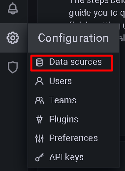
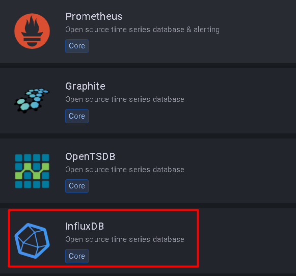
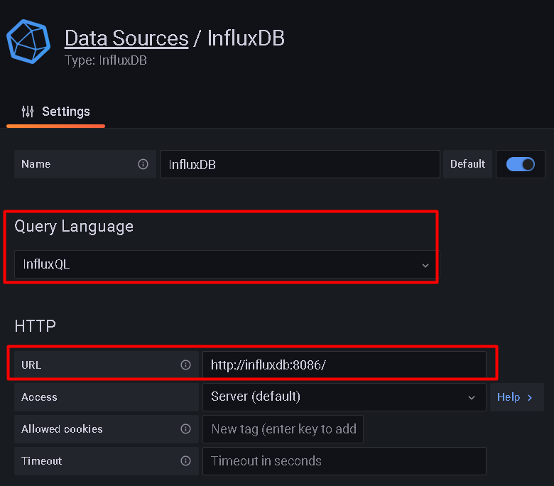
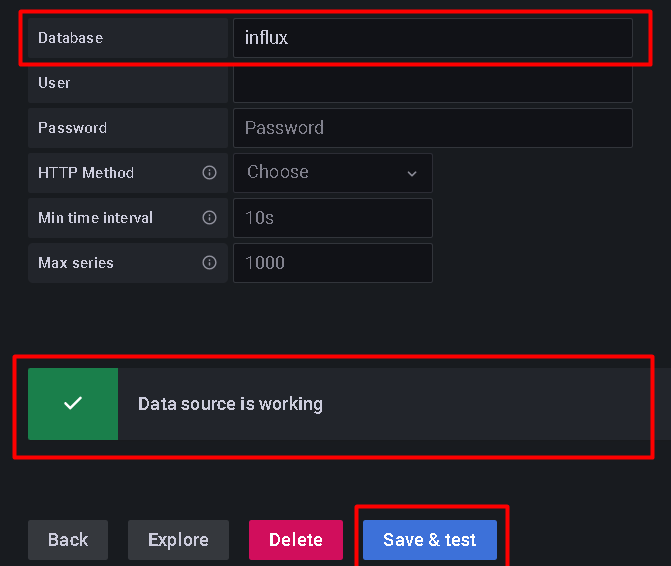
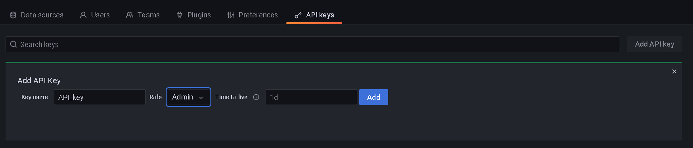
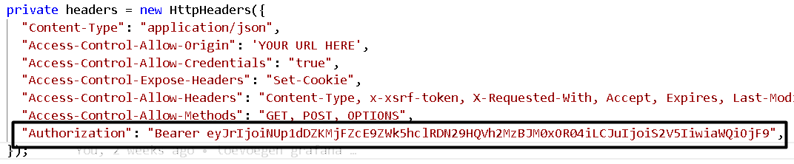

# Server Config

With this repository you can easily run our entire project on a server.

If you want to edit the backend or frontend locally, then you will also need this repository to have a working website.

## First start

Clone this repository onto a server or it can also be run locally on your own computer.
Then go to the root of the project and run:

```
docker-compose up -d
```

# The docker-compose file will run the following instances:

## PostgreSQL database

A PostgreSQL database to keep all the information of the users, campusses, classrooms...

One admin user is already made so that you can easily login.

```
email: admin
password: admin
```

If you run this in production be sure to delete this admin and change it by another with a better password!

## InfluxDB

The InfluxDB is used to keep all the data of the sensors.

## MQTT explorer

The MQTT explorer is needed to connect all the sensors to the InfluxDB and backend.

## Grafana

Grafana is used to make graphs of a single sensor on the website

If everything went good, you can now browse to the ip address of the server with the port of grafana, by example: http://188.166.43.149:3000.

A login screen will be shown and you have to login. The first time you login the username and password are admin. So first login with these credentials, next you can change your password. So take something you can remember but also something save.

Now you will see the overview page of grafana. On the left side you can see a menu. In the menu bar you see a cog wheel, if tou click it, the configuration tab will open. Here you select "Data sources", now select "Add data source" and select "InfluxDB" as type.




Now you will see the configuration screen for a InfluxDB, the name you don't need to change. The url you need to change to http://influxdb:8086/.



At the bottom of the page there is a input field with name "Database", here you fill in "influx". If you did everything correct you click "save and test" and you will see the message "Data source is working"



The next thing you need to do is create an API-key for the application. Press the cog wheel again and select "API keys", next you click on "Add API key". Now you can add a API key, give the key a name and make sure you set the role to ADMIN, don't give the key a time to live.



Now make sure you copy the key, because you won't be able to copy it again. When you have your key, you need to go to the "directory" frontend dan naar de directory "src" dan "app" dan "service" en open dan de file "grafana.service.ts" en verander de "Authorization header" naar "Baerer uw_API_key"



## Frontend

An angular frontend is used for the website. You can also run this on your own with this github repository [https://github.com/Wolkjes/frontend]

## Backend

A node backend is used for the backend. You can also run this on your own with this github repository [https://github.com/Wolkjes/backend]

<br>
<br>
<br>

## Add sensor

First update your sensor to the latest version: [https://github.com/Wolkjes/operame]

Then connect your sensor to the network and enter the correct IP-address:

<ol>
    <li>Turn the sensor on</li>
    <li>The sensor makes a wifi connection, connect to this with another device</li>
    <li>Then you will get a message to login on this wifi connection, open this and the configuration page will open in the browser</li>
    <li>Select the correct SSID of the password and enter the password of that SSID</li>
    <li>Enter the correct ip-address in the MQTT ip address box. This is the ip where you run all the server files (docker-compose file)</li>
    <li>Go to the bottom of the page and click on Save</li>
    <li>Then restart your sensor by clicking restart at the top of the page</li>
</ol>
